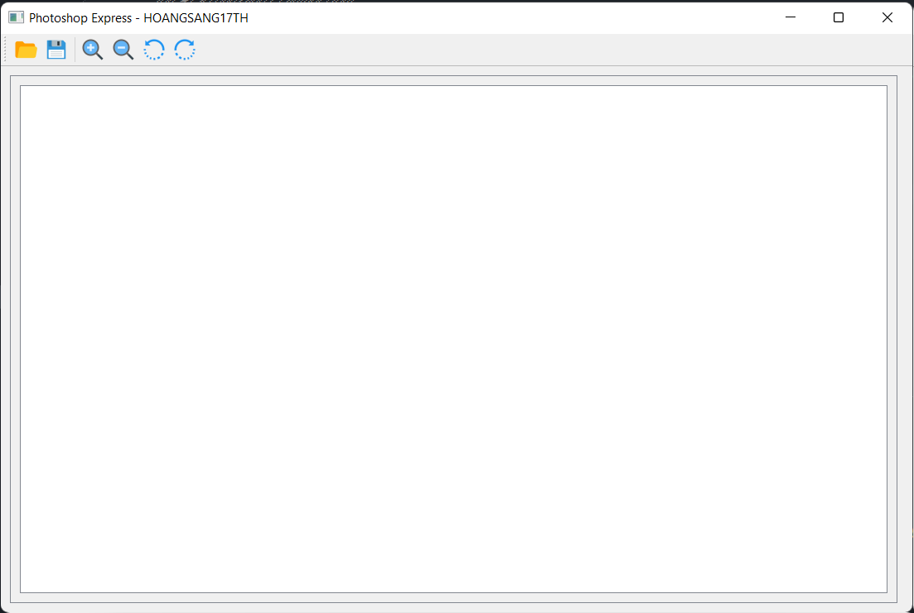
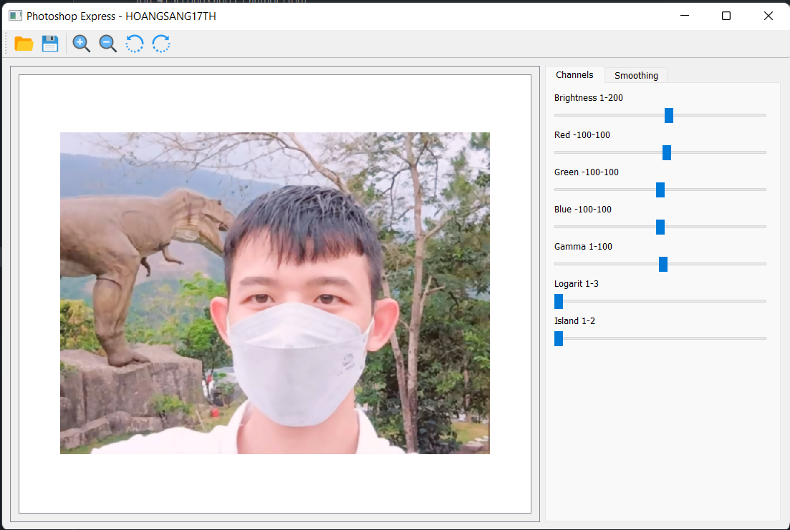
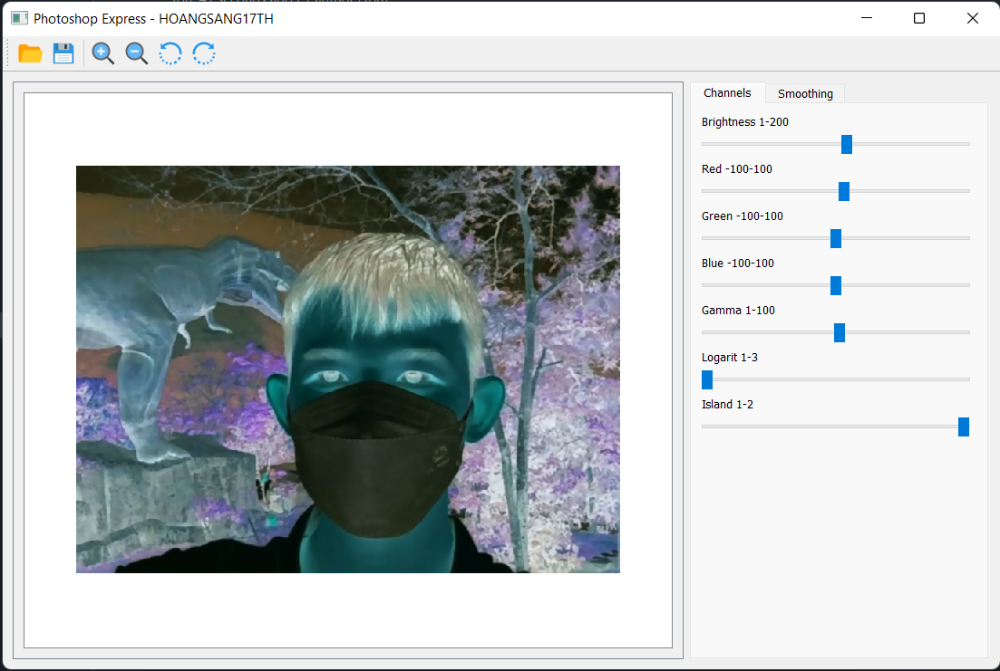

# Image-Processing

## How to build Ui form ui file

```
pyuic5 -x UI/app.ui -o UI/app.py
```

## Preview
### Default when user open app


### When user click open an new image


### Original image after being opened


### Photo after being island


## Please credit the source code when you use it